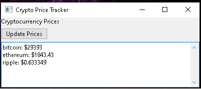

# CryptoTracker
Simple Crypto Tracker by vo1d.null



## Overview

The Crypto Price Tracker is a simple yet powerful desktop application that allows users to monitor real-time prices of various cryptocurrencies. 
It provides a user-friendly interface for tracking cryptocurrency prices, offering a seamless experience for both beginners and experienced users.

## Features

- **Real-Time Price Updates:** Stay up-to-date with real-time price data for BTC,ETH,XRP
- **User-Friendly Interface:** There is an update button.It updates every 5 mins due to free public API :).
- **Customization Options:** Personalize your app experience by choosing themes and base currency.
- **Responsive Design:** The app works smoothly on different screen sizes and orientations.

## Installation

1. Clone the repository:
   ```sh
   git clone https://github.com/your-username/crypto-price-tracker.git
2. Install the required dependencies:
   ```ah
   pip install -r requirements.txt
3. Run the app:
   ```ah
   python run_app.py
   
## Contributing

Contributions are welcome! If you'd like to contribute to this project, please follow these steps:

1.Fork the repository.

2.Create a new branch for your feature: git checkout -b feature-name.

3.Make your changes and commit them: git commit -m 'Add some feature'.

4.Push to the branch: git push origin feature-name.

5.Open a pull request.


## License
This project is licensed under the MIT License.

## Acknowledgements
1.wxPython: GUI library for Python.

2.API - Data provided by CoinGecko
